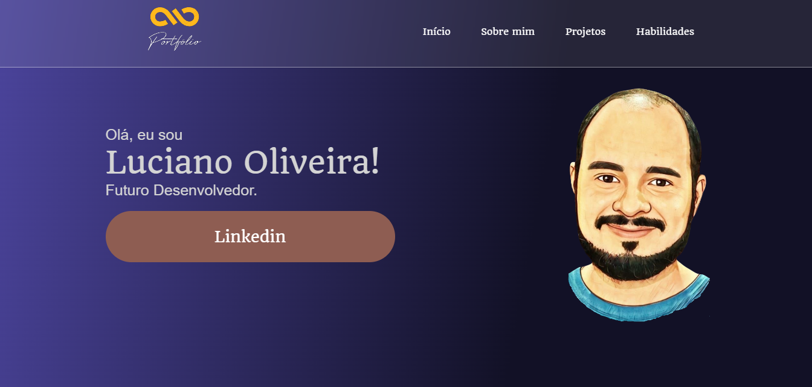

<!-- PROJECT LOGO -->
<br />
<p align="center">
  <a href="https://github.com/lucianodeveloper/Portfolio">
    
  </a>

  <h2 align="center">Meu portfólio</h2>

  <p align="center">
    Meu portfólio - Sobre mim, Projetos, Skills...
    <br />
    <a href="https://github.com/lucianodeveloper/Portfolio"><strong>Explore os arquivos »</strong></a>
    <br />
    <br />
    <a href="https://lucianodeveloper.vercel.app/">Ver Demo</a>
    ·
    <a href="https://github.com/lucianodeveloper/Portfolio/issues">Reportar Bug</a>
    ·
    <a href="https://github.com/lucianodeveloper/Portfolio/issues">Implementar Feature</a>
  </p>
</p>


<!-- TABLE OF CONTENTS -->
<details open="open">
  <summary>Lista de conteúdo</summary>
  <ol>
    <li>
      <a href="#Sobre-o-projeto">Sobre o projeto</a>
      <ul>
        <li><a href="#Construido-com">Construido com</a></li>
      </ul>
    </li>
    <li>
      <a href="#Como-usar">Como usar</a>
      <ul>
        <li><a href="#Pré-requisitos">Pré-requisitos</a></li>
        <li><a href="#Instalação">Instalação</a></li>
      </ul>
    </li>
    <li><a href="#Contribuindo">Contribuindo</a></li>
    <li><a href="#Licença">Licença</a></li>
    <li><a href="#Reconhecimentos">Reconhecimentos</a></li>
  </ol>
</details>

<!-- ABOUT THE PROJECT -->
## Sobre o projeto

<hr>

<hr>

O portfólio consiste basicamente em 6 seções:
- **Sobre Mim:** Breve descrição sobre mim e opções de contato
- **Projetos:** Projetos recentes, com imagem, descrição e link
- **Habilidades:** Cards com minhas atuais hard skills


### Construido com

As tecnologias usadas nesse projeto foram:
* [HTML](https://developer.mozilla.org/pt-BR/docs/Web/HTML)
* [CSS](https://developer.mozilla.org/pt-BR/docs/Web/CSS)
* [Javascript](https://developer.mozilla.org/pt-BR/docs/Web/JavaScript/)

<!-- GETTING STARTED -->
## Como usar

Acesse o projeto on-line: <a href="https://lucianodeveloper.vercel.app">Portfólio</a>

Este é um exemplo de como você pode dar instruções sobre como configurar seu projeto localmente. Para obter uma cópia local instalada e funcionando, siga estas etapas simples de exemplo.

### Pré-requisitos

``` Git, porém não é obrigatório, caso não queira fazer a instação via git, faça o download do repositório ```

### Instalação

```
# Clone este repositório
$ git clone https://lucianodeveloper.vercel.app.git

# Acesse a pasta do projeto no seu terminal/cmd
$ cd Portfolio

# Abra index.html no navegador e veja o projeto rodar
```


<!-- CONTRIBUTING -->
## Contribuindo

As contribuições são o que tornam a comunidade de código aberto um lugar incrível para aprender, inspirar e criar. Quaisquer contribuições que você fizer são ** muito apreciadas **.

1. Faça um fork do projeto
2. Crie seu Feature Branch (`git checkout -b feature / AmazingFeature`)
3. Faça commit de suas alterações (`git commit -m 'Add some AmazingFeature'`)
4. Envie para o Branch (`git push origin feature / AmazingFeature`)
5. Abra um pull request


<!-- LICENSE -->
## Licença

Distribuído sob a licença MIT. Veja `LICENSE` para obter mais informações.
